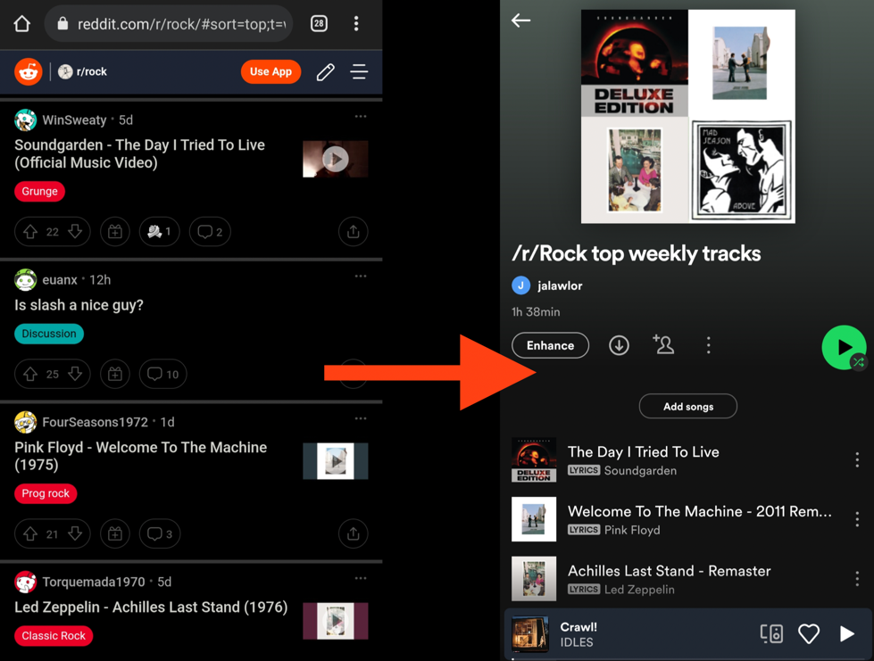

# reddit-playlists

**reddit-playlists** is the python code behind the `Reddit Playlists` project. 
You can find the project main page along with the list of playlists generated by this code [here.](https://jameslawlor.github.io/reddit-playlists/)
 
## Motivation

 I wanted to create a new way to explore and discover new music, based on the power of collective content curation.
There are hundreds of active music-related subreddits devoted to specific genres, bands etc. where members can post and upvote submissions.
 I decided to target the submissions that were for particular tracks, fortunately these are really common across all the music subreddits and the submissions generally follow a similar format and structure, an example is shown below.

#### Example
Taking the top track submissions in the last week from /r/Rock and adding them to a Spotify playlist. 
In the below example 3 of the 4 submissions are detected by the program as valid tracks, and they each follow the basic `$ARTIST - $TRACK` convention. 
 These are then searched for on Spotify and added to the corresponding subreddit's playlist.


 

## Setup

You can clone this repository with the command
 
```
git clone git@github.com:jameslawlor/reddit-playlists.git
```

Create a virtual environment and install the package requirements with `pip install -r requirements.txt`

You'll also need to create two new files to contain credentials for using the Spotify and Reddit APIs. 
Add these to the project root directory

* `praw.ini`
* `spotipy.cfg`

 See the [PRAW](https://praw.readthedocs.io/en/stable/) and [Spotipy](https://spotipy.readthedocs.io/) docs for how to set these up.
 They'll also show you how to create credentials for using the Spotify and Reddit APIs.
 If you're planning to share the code anywhere make sure you do not share the contents of these files! 
 These have been added to the `.gitignore` file already but please be mindful of this.

## Usage

 The main program can run different tasks by the command `python main.py --task $TASK` where `$TASK` is one of:
* `get_subreddits_and_genres` - scrape the list of music subreddits from the [/r/Music wiki](https://www.reddit.com/r/Music/wiki/musicsubreddits/) and adds them to a JSON file in `data/subreddit_genre_sub_count/`
* `create_empty_playlists` - create an initial set of empty playlists using the output from the first task
* `update_playlists` - Refresh the playlists with the previous week's top tracks. This is the task that is run weekly to maintain the Spotify playlists.
* `delete_playlists` - delete all user's Spotify playlists matching some regex pattern (use carefully)  
* `generate_subreddit_playlist_links_markdown_file` - creates a markdown file listing all subreddits and linking to their corresponding playlists

 The settings for these tasks are contained in the corresponding `.yaml` files in `configs/`.

## Current issues and future development

There are a couple of issues where the wrong tracks can be added or valid tracks missed completely for various reasons,
mainly because of the difficulty in handling the variability in submission format and due to remixes or covers and so on.
 Future development will probably focus on improving these problems.

At some point I would like to add support for archiving past playlists, currently they are overwritten entirely. 
I also think it could be useful to provide monthly top tracks for smaller subreddits that don't get many submissions.  

This is an open project so if you spot a way to improve anything feel free to create a PR :)

## About

 **reddit-playlists** is created and maintained by me, James Lawlor. 
 You can contact me via [LinkedIn](https://www.linkedin.com/in/james-lawlor/) or [Twitter](https://twitter.com/lawlorino).

## License

 MIT
